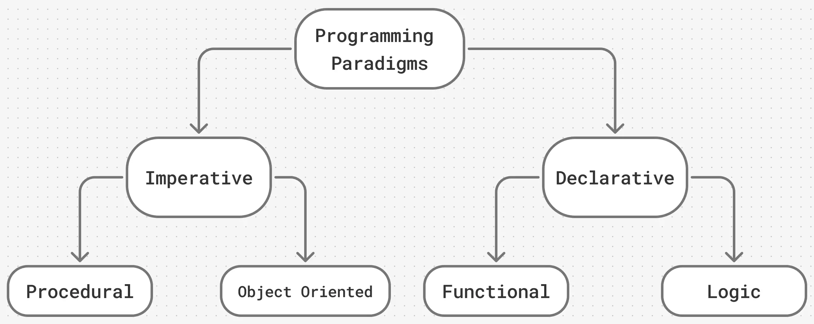
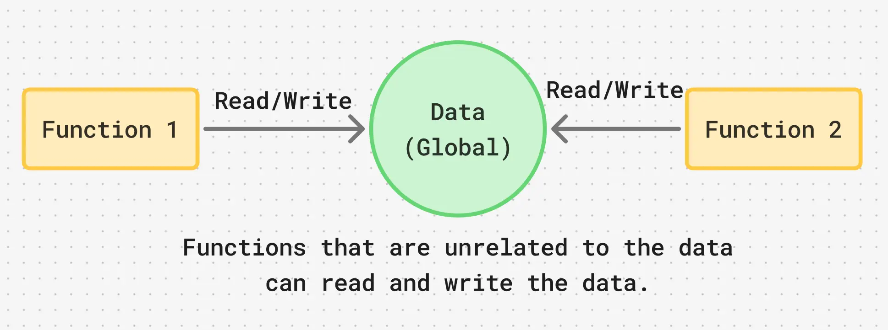
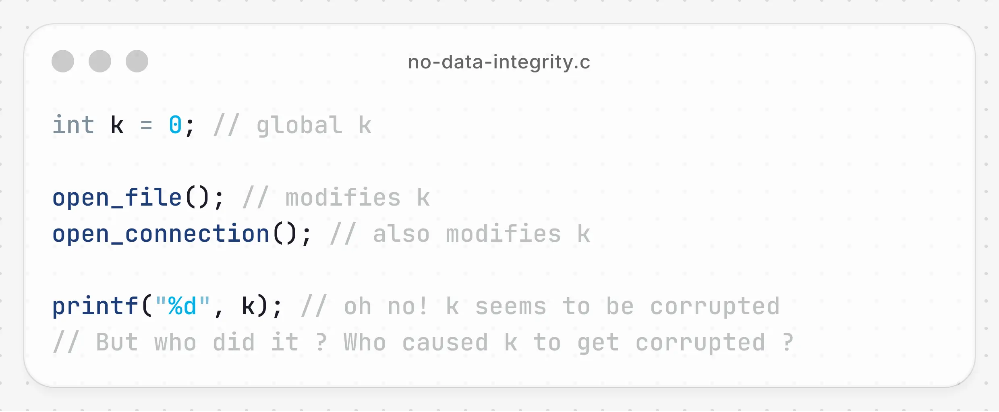
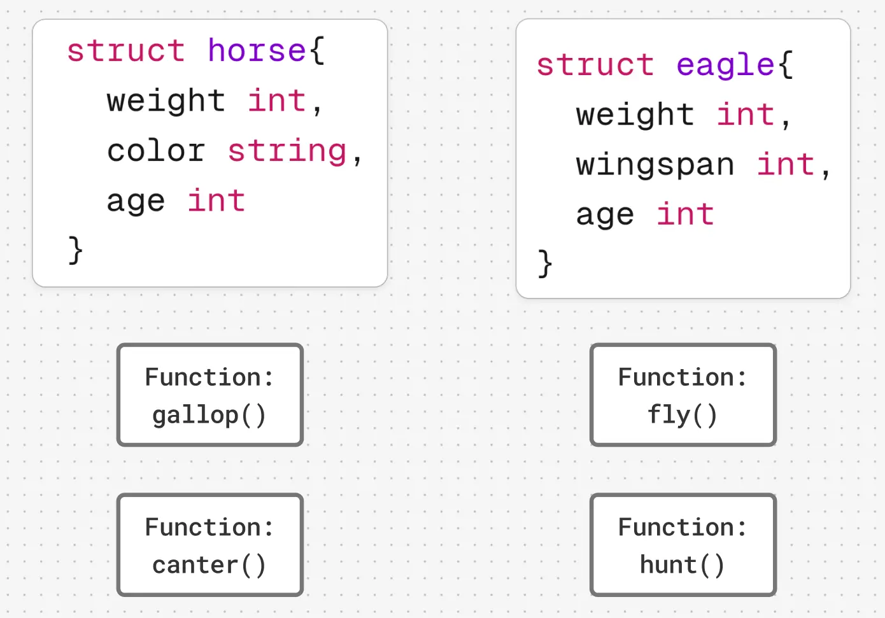

> "The entire history of software engineering is that of the rise in levels of abstraction"
> 

- Grady Booch

## Programming Languages & Paradigms

It is easy to look at the glowing screen of your smartphone and imagine there is a little all-knowing brain inside. However, a seasoned architect who can look past the polished interfaces knows the truth: a computer is, at its core, nothing but a vast grid of microscopic transistors, flipping on and off in the dark.

On their own, these switches are simple, mindless things. But chain enough of them together, and they work like a relentless swarm of ants building staggering structures out of pure logic. Today, these machines govern the globe. They route the internet, and they power the very artificial minds doing the thinking for us. But at the end of the day, it is all just electrical currents bleeding through silicon at precisely the right moments.

Now, being the pragmatic scholar you are, you have to wonder: how did we ever figure out a way to orchestrate this? How do you instruct a machine that has no intuition, cannot infer your desires, and only does exactly what it is told?

This is where programming languages come in. Just as a merchant must learn the local dialect to survive in a foreign market, anyone wishing to tame a computer must learn its tongue. These languages are the vital bridge between human intent and raw hardware.

While a **language** provides the **vocabulary**, you still need a strategy. That **strategy is called a paradigm.** Think of a paradigm as the specific mindset or philosophy a programming language uses to look at a problem.

Generally, we divide these mindsets into four main camps:
1. Procedural
2. **Object Oriented**
3. Functional
4. Logic

Here is a brief overview of how these paradigms work:
| Programming Paradigm | The Philosophy                                                |
| -------------------- | ------------------------------------------------------------- |
| Procedural           | What exact steps should be done next?                         |
| Object Oriented      | What are the entities (objects) here, and how do they behave? |
| Functional           | How can we evaluate this data through mathematical functions? |
| Logic                | What rules and facts must be true to solve this?              |

## The Shift: Procedural to Object-Oriented
For a long time, the Procedural paradigm was the king of the hill. However, as software systems grew from simple scripts into massive, complex applications, developers started running into severe growing pains. This paved the way for the Object-Oriented Programming (OOP) paradigm, which has been the industry standard for decades now.

But why make the shift? What makes procedural programming so difficult to scale? Let's look at a few of the inherent **drawbacks of the procedural mindset**.

#### Functions Run the Show

In **procedural** languages, functions (the actions) are the **primary building blocks**. The data is just lying around, waiting to be acted upon. If you aren't incredibly disciplined, multiple unrelated functions can end up reading and modifying the exact same block of data.

#### The Nightmare of Unowned Data
Because data in a procedural environment doesn't strictly belong to anyone, it is **incredibly difficult to maintain data integrity**. Imagine a busy kitchen where fifty chefs are all trying to season the same pot of soup. If the soup ends up far too salty, how do you figure out which chef ruined it? When your program's data gets corrupted or a network connection is left dangling open, pinning down the exact function responsible becomes a frustrating game of hide-and-seek.

#### A Lack of Natural Boundaries (Encapsulation)
Perhaps the biggest hurdle in procedural programming is **how it models the real world**. Ideally, we want to build **Abstract Data Types**, which **bundle data and the functions that operate on that data into one neat package**.

Let's look at nature. We know that a horse has a weight, a color, and an age—and it can gallop or canter. An eagle also has a weight and an age, but it flies and hunts. A horse cannot fly, and an eagle cannot gallop.

In a purely procedural language, however, those functions (`gallop()`, `fly()`) are just floating around globally. There is no strict, built-in boundary preventing a careless programmer from trying to make the eagle structure gallop.

**In short, procedural languages suffer from the following drawbacks:**
1. Data does not have an owner.
2. Difficult to maintain data integrity
3. Functions are the building blocks
4. Many functions can modify a given block of data
5. Difficult to pinpoint bug sources when data corrupted.

This is the very problem Object-Oriented Programming was born to solve: **tying the behaviors directly to the data they belong to**, bringing order, safety, and sanity back to the codebase.

    <a href="/oops/2" class="next-button">Next</a>

