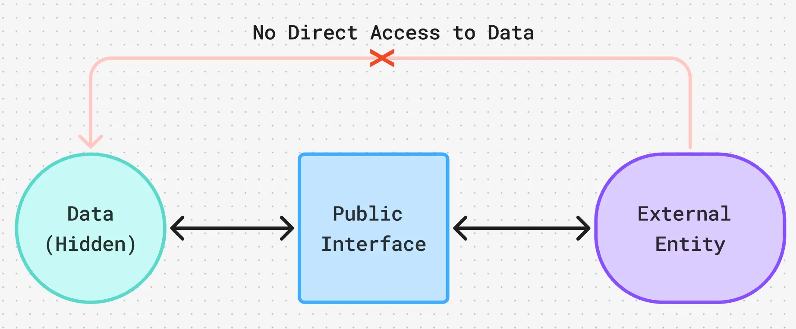
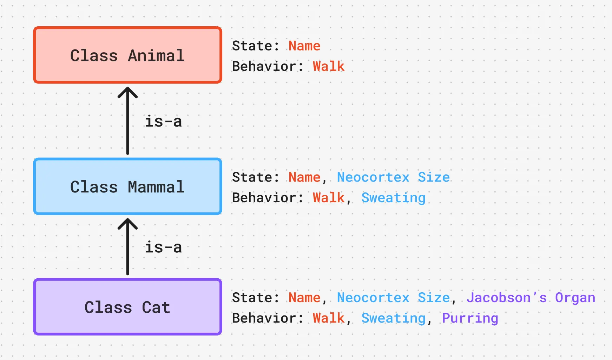
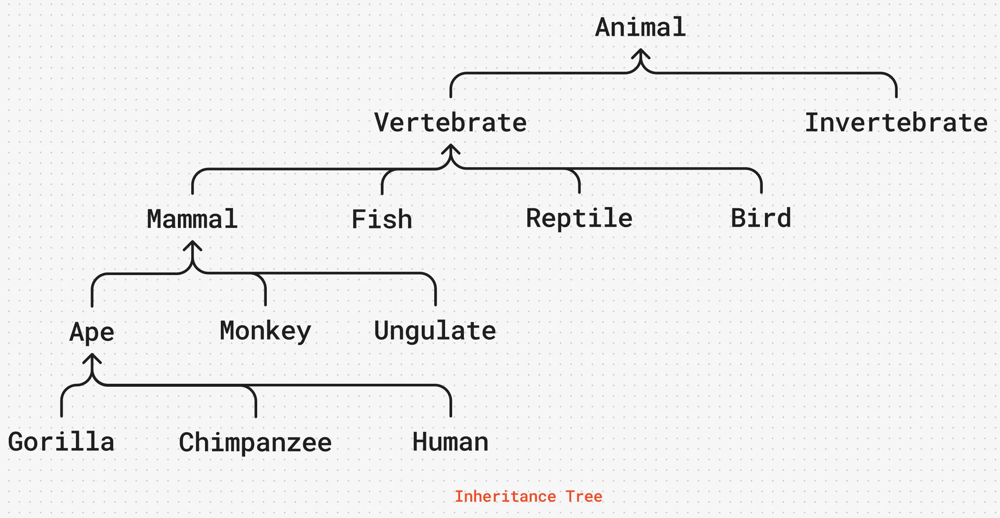
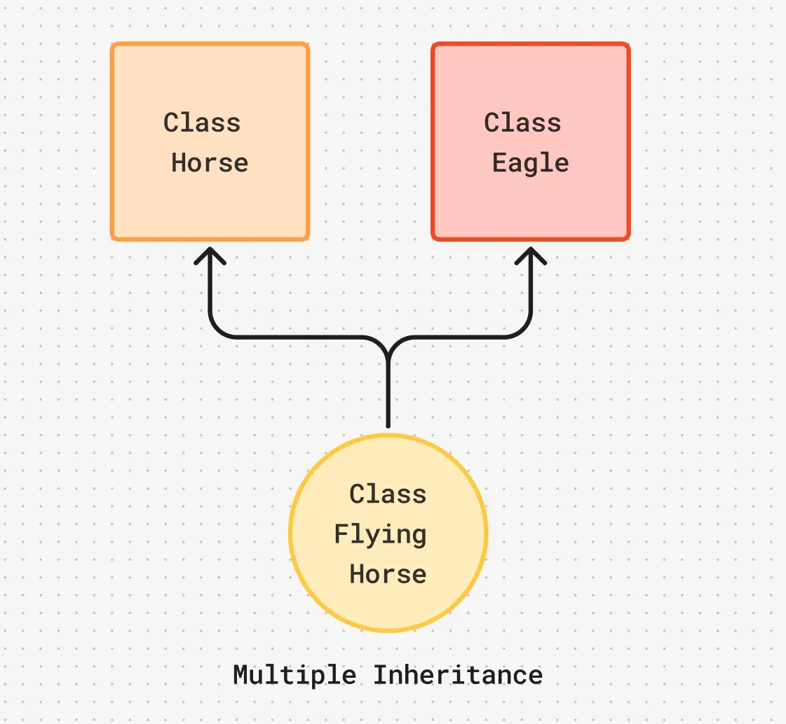
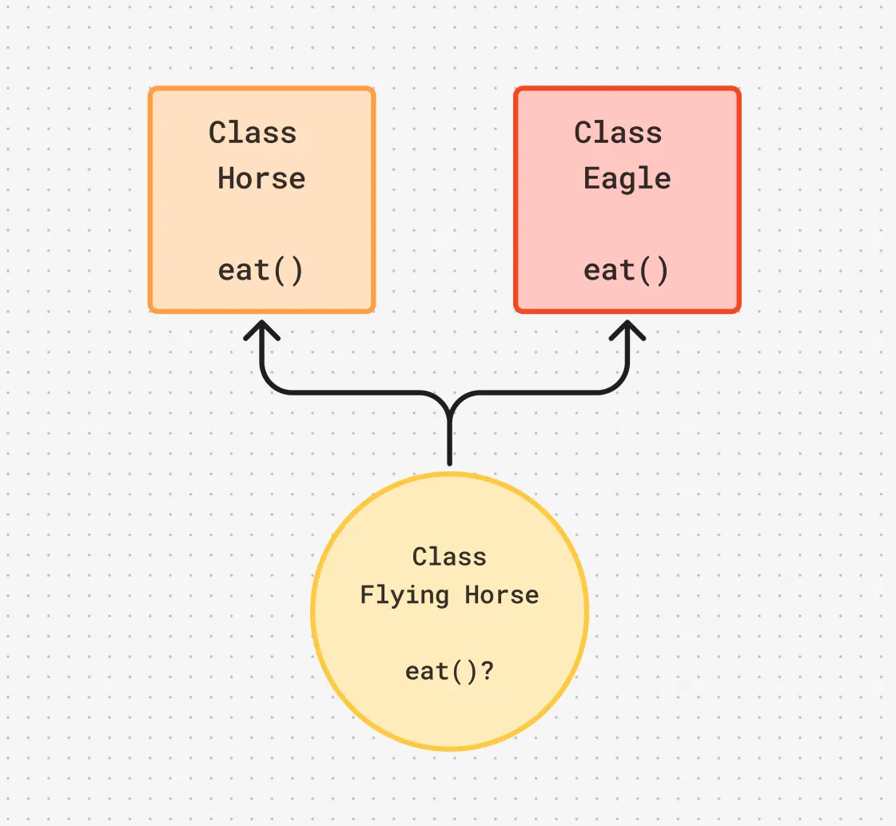

Let us now look at some important concepts that make the Object Oriented Paradigm Special.

## Abstraction: The Art of Perspective

In software engineering, abstraction is the practice of **stripping away unnecessary details** to focus only on the **essential characteristics** of an entity. Now, what is **"essential"** is entirely **relative** to the perspective of the viewer. Consider a physical Book. If you hand that book to three different professionals, they will each abstract it in entirely different ways based on what matters to them:

- The **Writer** sees the themes, the narrative arc, and the character development.
- The **Publisher** sees a retail product with a page count, a profit margin, and a target demographic.
- The **Linguist** sees sentence structures, vocabulary complexity, and dialect.

None of them are wrong; they are simply abstracting the book to fit their specific domain. In programming, abstraction is how we decide exactly which parts of a real-world entity our software actually needs to care about.

#### The Class: State Meets Behavior

Once we have used abstraction to decide what our entity is, we need a way to represent it in our code. This brings us back to our horse and eagle.

If we are building a wildlife simulation, our abstraction tells us that a horse needs to gallop and canter, while an eagle needs to fly and hunt. It makes logical sense to tie these specific actions directly to the animals themselves. In OOP, we do this by creating a Class.

A Class is a structural **blueprint** that combines two vital things:

- **State**: The characteristics or data that describe the entity (e.g., name, age, color).

- **Behavior**: The actions or functions the entity can perform.

- **Class = State + Behavior**

Let's look at how we might model a superhero using a Class:
| The **Hero** Class | |
| ---------------------- | ------------------------------ |
| **State (Attributes)** | `Name`, `Age`, `Superpowers` |
| **Behavior (Methods)** | `fly()`, `fight()`, `rescue()` |

In this example, the **State** defines what the hero **is**, and the **Behavior** defines what the hero **can do**.

#### The Object: Bringing the Blueprint to Life

If a Class is the blueprint, an Object is the actual, tangible house built from that blueprint.

While a class defines the general state and behavior of a concept, an object represents a specific, unique instance (or **realization**) of that class. Because it is unique, an object has one additional, crucial property: **Identity**.

- **Simply put: Object = State + Behavior + Identity**

Going back to our Hero class, "Hero" is just the abstract definition. It doesn't actually exist in the world. However, Superman is an Object. He has a specific state (Name: Clark Kent, Age: 35), the defined behaviors (he can fly and fight), and a unique identity that separates him from another Object like Doctor Strange.

You only ever need to write the Class blueprint once, but you can use it to spawn as many unique Objects as your program requires.

## Encapsulation: Guarding the Kitchen

Imagine for a moment that you are the head chef of a world-class restaurant. You have spent years perfecting your flagship dish. Now, would you ever let a customer just stroll into your kitchen, grab a handful of ingredients, poke at your simmering sauces, and plate the food themselves?

Of course not! You would fiercely restrict access to your kitchen to safeguard your recipes and ensure the food is prepared perfectly every single time. The customer never sees the messy reality of the kitchen; they only interact with the waiter, and they only see the beautifully plated final dish.

This brings us to the first great law of the Object-Oriented paradigm: **Data must be hidden**. We call this **Encapsulation**. While a Class bundles data and behavior together, Encapsulation acts as the walls of the kitchen, **hiding the internal implementation details** of your object from the outside world.

Instead of letting other parts of your program reach in and tamper with an object's variables directly, you force them to communicate through a "waiter." In OOP, this waiter is your **Public Interface**—a specific set of public methods (functions) that you intentionally expose to the outside world.

#### Total Control Over Your Data

By hiding the raw data behind this public interface, you gain absolute control over how that data is used. Using specific read and write methods (often called **getters** and **setters**), you can define four strict levels of access for any piece of information:

1. **Read & Write**: The outside world can view and modify it.
2. **Read-Only**: The outside world can see it, but cannot change it.
3. **Write-Only**: The outside world can provide it, but cannot look at it (like a password).
4. **Completely Hidden**: Strictly for internal use only.

#### The Freedom to Change Your Mind

There is a massive, often-overlooked advantage to hiding your implementation details: **flexibility**. Let's go back to your restaurant. If there is a sudden shortage of your usual brand of cooking oil, you can quietly switch to a different brand. Because the customer only interacts with the final dish via the waiter, they will never notice the change in your internal process.

In software, if you decide to completely rewrite the mathematical logic inside a class to make it run faster, you can do so without breaking the rest of the program, as long as the public interface remains exactly the same.

#### The Lifecycle of a Safe Object

We know an object has state, behavior, and identity. But if we are so concerned with protecting its data, how do we ensure it is set up correctly the moment it is brought into existence?

A robust, encapsulated object should follow a very specific lifecycle:

1. **Born Healthy**: We use special **setup functions** called **Constructors** to ensure the object is initialized with all the valid data it needs the very moment it is created. No half-baked objects allowed.
1. **Lives Safely**: Throughout its life, its state is protected. Other objects can only alter it by politely asking its **public interface**.
1. **Dies Cleanly**: When the object is no longer needed, special **teardown functions** called **Destructors** clean up any open files, database connections, or memory, ensuring the program remains tidy.

## Inheritance: Standing on the Shoulders of Giants

There will inevitably be times in your engineering career when you need to build something that is just a specialized version of something that already exists.

Imagine you are a physicist who just discovered a new subatomic particle. You wouldn't throw away centuries of physics and start calculating from scratch. You would rely on the established knowledge base and simply build upon what is already there. Software engineering operates on the exact same principle. When we want to **reuse**, **extend**, or **specialize** existing code, we use **Inheritance**.

**Inheritance allows a new class to absorb the state and behavior of an existing class.**

Instead of copying and pasting code, you simply tell the computer, `"Make this new thing exactly like that old thing, but add these specific tweaks."`

#### The "Is-A" Relationship

Let's look at how we might categorize living creatures.

At the very top, we have a broad **Animal** class. An animal has a name, and it can walk.
If we want to model a **Mammal**, we don't need to rewrite the name and walk logic. We simply **inherit** from **Animal**. Now, our Mammal automatically gets a name and the ability to walk, but we can extend its functionality by giving it a neocortex and the ability to sweat.
Finally, we can create a **Cat** that **inherits** from **Mammal**. The cat gets everything from the animal and mammal levels, but we specialize it further by adding a Jacobson's organ and the ability to purr.

This creates a strict, **bottom-up relationship** known in the industry as the **"Is-A"** relation.
A Cat **is-a** Mammal. A Mammal **is-a** Animal.

> If you can't logically say "is-a" between your classes, you probably shouldn't be using inheritance!

To keep our conversations clear, the industry uses specific nomenclature to describe who is inheriting from whom:

| Description                     | The Nomenclature                                    |
| ------------------------------- | --------------------------------------------------- |
| The existing class at the top   | Parent Class, Superclass, or Base Class (Preferred) |
| The new class inheriting traits | Child Class, Subclass, or Derived Class (Preferred) |

#### The Inheritance Tree

When mapping out these relationships, we build an Inheritance Tree. This isn't a runtime data structure; rather, it is a conceptual hierarchy that shows exactly how different classes are related and who derives from whom.

While you theoretically could map these relationships using a complex web or graph, doing so quickly becomes a tangled nightmare. A strict, bottom-up tree keeps your architecture clean, understandable, and easy to maintain.

#### The Danger of Multiple Inheritance

What happens if a child class tries to inherit from two different parent classes at the same time? This is known as Multiple Inheritance.

Suppose we want to create a **FlyingHorse**. We might be tempted to have it inherit from both a **Horse** class and an **Eagle** class.

At first glance, this seems clever. But what happens if both the Horse parent and the Eagle parent have an `eat()` behavior?

When our new flying horse gets hungry and tries to `eat()`, the compiler panics. **Should it eat like a horse, or eat like an eagle?** This creates an **ambiguity** known in software engineering as **The Diamond Problem**.

Because multiple inheritance so easily leads to these convoluted conflicts, many modern programming languages (like Java and C#) outright forbid a derived class from having more than one base class. While languages like C++ do allow it, it requires strict safeguards. As a general rule of thumb, keep your inheritance trees simple, and avoid multiple inheritance unless you have a flawless reason to use it.

### Overriding: Redefining the Rules

Because child classes inherit behavior from their parents, you might occasionally run into a scenario where the parent's default behavior just doesn't quite fit the child.

Imagine you have a base class `A` with a built-in function called `do()`. When you create a subclass `B` that inherits from `A`, the `do()` function naturally comes along for the ride. But what if `B` needs to accomplish that task in an entirely different way?

You don't need to rename the function or hack the parent class. You can simply redefine `do()` directly inside class `B`. By writing a new version of the function in the child class, you **override** the parent's version.

Now, whenever you call `B.do()`, the computer ignores the parent's instructions and executes `B`'s custom logic instead. **Overriding** is simply the act of a child class looking at an inherited behavior and saying, _"Thanks for the suggestion, but I have a better way of doing this."_

### Polymorphism: One Interface, Many Forms

The word "Polymorphism" can sound incredibly intimidating, but its Greek roots give the secret away: poly means "many," and morph means "forms." It is simply the ability of different objects or functions to respond to the exact same instruction in their own unique ways.

There are two primary flavors of polymorphism every practitioner must know:

#### 1. Overloading (Compile-Time Polymorphism)

This is when you have a single concept taking multiple forms based on the data you feed it. Imagine you write an `add()` function. You could have one version that reads `add(int x, int y)` to handle whole numbers, and another entirely separate version named `add(double x, double y)` to handle decimals. They share the same name, but take different forms depending on the arguments you provide.

#### 2. Subtype (Runtime) Polymorphism

This is the true crown jewel of OOP. Because a `Dog` and a `Cat` both inherit from `Animal`, you can group them together in a list of `"Animals"`. If you tell every animal in that list to speak(), the program is smart enough to look at the specific object and trigger its overridden behavior. The dog will bark, and the cat will meow—even though you gave them the exact same command. One command, many forms.

At this point, we have covered the most important concepts related to OOP.
I hope it was a good revision for you. If any of the points seem confusing or loose, please note we will be looking at code snippets and examples in the future which will clear most confusions away, so stay tuned for that.

## The Pillars of a Robust System

Once you understand how classes, objects, and inheritance work, you must learn how to organize them. A good architect relies on a few core principles to keep massive systems from collapsing into chaos.

## Modularity: Boxing Up Your Abstractions

If abstraction is the act of stripping away unnecessary details to focus on a specific viewpoint, Modularity is the act of packing those abstractions into neat, self-contained boxes. Instead of writing one massive, million-line file, we separate our logic into discrete units—like **Classes**, **Packages**, and **Domains**. When a system is highly modular, **you can safely unplug and replace one component without accidentally breaking the rest of the machine**.

## Typing: Guarding the Gates

When we create these distinct abstractions, we need to ensure they don't accidentally get mixed up. You wouldn't want the program to accidentally try to multiply a Cat by the number 7. This is handled by a language's Typing System:

- **Strong Typing** acts as a strict checker. It absolutely forbids different types of data from interacting unless you explicitly convert them first.
- **Weak Typing** is far more lenient, allowing the language to secretly guess and convert types behind your back (which can lead to nasty bugs).
- _(Note: Do not confuse this with Static vs. Dynamic typing, which simply refers to whether the computer checks these rules before the program runs, or while it is actively running!)_

## Concurrency: The Art of Multitasking

In the real world, things happen simultaneously. Concurrency allows different objects and processes in your software to act at the exact same time, rather than politely waiting in a single-file line. It is what allows your web browser to download a file in the background while you continue to scroll down a page.

## Persistence: Surviving the Dark

An object lives in the computer's volatile memory (RAM). The moment the power goes out or the program closes, that object is wiped from existence. Persistence is the mechanism of saving an object's state and identity across time and space by writing it to a permanent storage medium, like a hard drive or a database. It ensures that when your user logs back in tomorrow, their data is right where they left it.

## What Comes Next?

At this point, we have covered the foundational concepts of the Object-Oriented paradigm. We have covered a massive amount of ground today.

If your head is spinning a little, or if some of these ideas still feel a bit abstract, take a deep breath, that is perfectly normal. Today was just the high level overview. In the upcoming dispatches, we will jump into these concepts with actual code snippets and implementations.

Seeing these pillars in action will connect all the dots and clear up any lingering confusion. Until then, grab another cup of coffee, let these ideas settle, and get ready for the next battle. Stay tuned!

    <a href="/contents" class="next-button">Contents</a>
    <a href="/" class="next-button">Home</a>
    <a href="/oops/1" class="next-button">Back </a>

